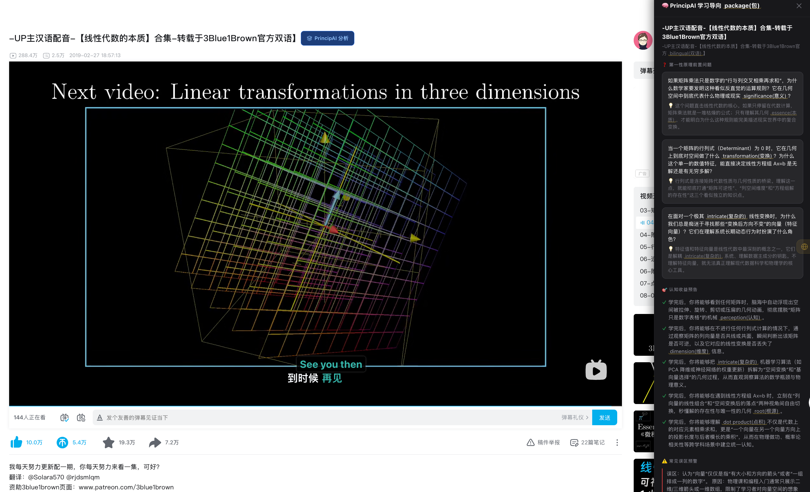

<div align="center">

**[中文](README.md)** | **[English](english.md)**

</div>

# PrincipAI

> **Learn from first principles, not the first page.**
>
> 前置式主动学习引擎 — 在观看视频/阅读书籍之前，AI 先生成「学习导向包」，让你带着问题主动学习，而不是被动接收。

---

## 为什么需要 PrincipAI？

95% 的 MOOC 学习者无法完成课程。即使"看完"了，大多数人仍然无法真正应用所学。

认知科学将此称为 **流畅性幻觉（Fluency Illusion）**：被动观看视频时，大脑产生"我懂了"的错觉，但实际并未形成深层理解和持久记忆。

**PrincipAI 的理念：** 在学习之前，先用第一性原理问题锚定你的认知框架。带着问题去看内容，把"被动接收信息"变成"主动寻找答案"。

## 核心功能

用户输入视频链接，AI 生成 **学习导向包**：

| 模块 | 说明 |
|---|---|
| 🧩 **编排逻辑拆解** | 作者为什么按这个顺序讲？章节之间的因果关系是什么？ |
| ❓ **第一性原理前置问题** | 每集/每章 2-3 个学完必须能回答的本质问题 |
| 🎯 **认知收益预告** | 学完这一集，你能做什么之前做不到的事？ |
| ⚠️ **常见误区预警** | 大部分人学到这里会怎么误解？提前规避 |
| 🗺️ **交互式思维导图** | 知识结构可视化，章节间的逻辑关系一目了然 |
| ✏️ **出题测验** | AI 生成测验题，验证真正理解而非"看过了" |

### 效果预览

<p align="center">
  
</p>

### 当前阶段：Phase 2 🚀

> **Phase 2 已完成核心功能开发**，以下是当前可体验的能力：
>
> - 🎬 **视频平台支持**：YouTube + Bilibili 双平台字幕提取
> - 🧠 **灵活 LLM 接入**：DashScope（推荐国内）/ OpenAI / 任意兼容 API
> - 📚 **预设课程 Demo**：3Blue1Brown **线性代数**（11 集）+ **微积分**（11 集）
> - 🗺️ **交互式思维导图**：点击折叠/展开，知识结构一目了然
> - ✏️ **出题测验**：AI 生成单选题 + 即时反馈 + 解析
> - 🌐 **浏览器插件（基础版）**：Chrome MV3，视频页注入按钮 + 侧边栏展示

#### 浏览器插件示意

<p align="center">
  
</p>

> 💡 你可以将自己截取的插件效果图放到 `assets/extension-preview.png`，或替换其他阶段性截图。
> `assets/` 目录用于存放所有阶段性效果展示图片。

### 示例：3Blue1Brown 线性代数

```
向量篇 — 前置问题：
"为什么向量可以同时表示箭头、坐标、数据点？
 这三种表述的本质统一在哪里？"

矩阵乘法篇 — 前置问题：
"为什么矩阵乘法要按「行×列」的规则定义？
 从几何变换的角度，这个规则是必然的吗？"

特征向量篇 — 前置问题：
"为什么几乎所有理工科领域都在用特征值/特征向量？
 它到底在找一个变换的什么核心不变属性？"
```

## 快速开始

### 安装

```bash
git clone https://github.com/askxiaozhang/princip-ai.git
cd princip-ai
npm install
```

### 配置 API Key（可选，启用动态生成）

创建 `.env.local` 文件：

```bash
# 方式一：DashScope（推荐，国内可用）
# 前往 https://coding.dashscope.aliyuncs.com/apps/anthropic 获取 API Key
API_KEY=sk-your-dashscope-key
API_BASE_URL=https://dashscope.aliyuncs.com/compatible-mode/v1
API_MODEL=qwen-plus   # 或 claude-3-5-sonnet-20241022 等支持的模型

# 方式二：OpenAI（国际版）
API_KEY=sk-your-openai-key
API_MODEL=gpt-4o

# 方式三：保持向后兼容（旧版配置仍有效）
OPENAI_API_KEY=sk-your-key-here
```

> 💡 **没有 API Key？** 应用内置了 3Blue1Brown **线性代数**和**微积分**系列的 Demo 数据，可以直接体验！

### 运行

```bash
npm run dev
```

### 使用

1. 打开 `http://localhost:3000`
2. 输入视频链接（YouTube 或 Bilibili）
3. 获取学习导向包
4. 查看思维导图，了解知识结构
5. 带着问题去看视频，结束后出题检验

## 技术架构

```
用户输入（YouTube/Bilibili 链接）
        │
        ▼
  ┌─────────────┐
  │  字幕提取    │  YouTube: youtubei.js / Bilibili: subtitle API
  └──────┬──────┘
         │
         ▼
  ┌─────────────┐
  │  结构分析    │  OpenAI GPT-4o / DashScope / Claude API
  └──────┬──────┘
         │
         ▼
  ┌─────────────┐
  │  导向包生成  │  问题集 + 逻辑图 + 收益 + 误区
  └──────┬──────┘
         │
         ▼
  ┌─────────────────────────────┐
  │  可视化展示                  │
  │  · 学习导向包（文字卡片）     │
  │  · 交互式思维导图            │
  │  · 出题测验                 │
  └─────────────────────────────┘
```

## 浏览器插件（Phase 2 开发中）

浏览器插件已完成基础框架开发，支持 Chrome/Edge（Manifest V3）。

### 安装方式（开发者模式）

1. 打开 Chrome，进入 `chrome://extensions`
2. 开启右上角「开发者模式」
3. 点击「加载已解压的扩展程序」
4. 选择项目中的 `browser-extension/` 目录

### 核心能力

```
┌─────────────────────────────────────────────────────────────┐
│  🌐 浏览器插件                                               │
├─────────────────────────────────────────────────────────────┤
│                                                             │
│  ① 自动检测视频页面                                          │
│     在 YouTube / Bilibili 视频页面旁加入「PrincipAI 分析」按钮 │
│                                                             │
│  ② 一键生成学习导向包                                        │
│     点击按钮 → 调用本地 PrincipAI 服务 → 在侧边栏展示结果    │
│                                                             │
│  ③ 思维导图生成（规划中）                                    │
│     生成类似 XMind 的交互式知识导图                          │
│     章节之间的逻辑关系、前置概念、核心推导一目了然            │
│                                                             │
│  ④ 智能暂停 + 思考锚点（规划中）                             │
│     在关键概念处自动暂停视频，抛出引导性问题                  │
│                                                             │
│  ⑤ 观后测试（规划中）                                        │
│     看完视频后生成针对性的测试题                             │
│                                                             │
└─────────────────────────────────────────────────────────────┘
```

### 学习闭环

```
观看前                观看中                  观看后
  │                     │                       │
  ▼                     ▼                       ▼
┌─────────┐        ┌──────────┐           ┌──────────┐
│Prelearning│       │ 智能暂停  │           │ 观后测验  │
│ 导向包    │ ───▶ │ 思考锚点  │  ───▶     │ 巩固检验  │
│ 思维导图  │       │ 沉浸式    │           │ 个性化    │
└─────────┘        └──────────┘           └──────────┘
     │                    │                       │
     └────────────────────┴───────────────────────┘
                          │
                          ▼
                   真正的第一性原理理解
```

## 技术栈

| 组件 | 技术选型 |
|---|---|
| 前端 | Next.js 16 + TailwindCSS v4 |
| 后端 | Next.js API Routes (Node.js) |
| YouTube 字幕 | youtubei.js + 直接 HTTP API |
| Bilibili 字幕 | Bilibili Subtitle API |
| LLM | OpenAI GPT-4o / DashScope / 任意 OpenAI 兼容 API |
| 浏览器插件 | Chrome Manifest V3 |
| 部署 | Vercel |

## 项目结构

```
princip-ai/
├── README.md
├── english.md
├── feasibility-report.md      # 可行性调研报告
├── core.md                    # 产品核心思路
├── assets/                    # 阶段性效果展示图片
│   ├── screenshot.png         # 主站效果预览
│   └── extension-preview.png  # 浏览器插件示意（待添加）
├── browser-extension/         # 浏览器插件（Chrome MV3）
│   ├── manifest.json
│   ├── content.js             # 视频页面注入脚本
│   ├── content.css
│   ├── background.js          # Service Worker
│   ├── popup.html             # 插件弹窗 UI
│   ├── popup.js
│   └── icons/
├── src/
│   ├── app/                   # Next.js App Router
│   │   ├── api/
│   │   │   ├── generate/      # 学习导向包生成 API
│   │   │   ├── transcript/    # 字幕提取 API
│   │   │   └── quiz/          # 出题测验 API
│   │   ├── layout.tsx
│   │   ├── page.tsx           # 主页（含导向包 + 思维导图 + 测验 Tab）
│   │   └── globals.css
│   ├── components/
│   │   ├── URLInput.tsx       # URL 输入框（支持 YouTube/Bilibili）
│   │   ├── LearningPackageView.tsx
│   │   ├── EpisodeCard.tsx
│   │   ├── NarrativeLogic.tsx
│   │   ├── ChapterDependencies.tsx
│   │   ├── MindMap.tsx        # 交互式思维导图
│   │   └── QuizView.tsx       # 出题测验弹窗
│   └── lib/
│       ├── types.ts
│       ├── youtube.ts         # YouTube URL 解析（含微积分系列）
│       ├── bilibili.ts        # Bilibili URL 解析 + 字幕提取
│       ├── transcript.ts      # YouTube 字幕提取
│       ├── prompts.ts
│       ├── analysis.ts        # LLM 分析（支持 DashScope/OpenAI）
│       └── generation.ts      # 导向包生成（线代 + 微积分 Demo）
└── package.json
```

## 路线图

- [x] **Phase 0** — 可行性调研与竞品分析 ✅
- [x] **Phase 1** — MVP：3Blue1Brown 线代专属版 ✅
  - [x] 项目脚手架搭建（Next.js 16 + TypeScript + TailwindCSS v4）
  - [x] YouTube 字幕提取（双通道 fallback：youtubei.js + 直接 HTTP API）
  - [x] LLM 分析管线（OpenAI GPT-4o，JSON 结构化输出）
  - [x] 3Blue1Brown 线性代数 Demo 数据（11 集全量学习导向包）
  - [x] 完整的 UI 组件（URL 输入、导向包展示、可展开单集卡片）
  - [x] 响应式暗色主题
- [x] **Phase 2** — 扩展内容与浏览器插件 🚀
  - [x] **灵活 API 配置**：支持 DashScope、OpenAI 或任意 OpenAI 兼容 API（`API_KEY` + `API_BASE_URL` + `API_MODEL`）
  - [x] **Bilibili 字幕提取**：通过 Bilibili Subtitle API 提取 CC 字幕
  - [x] **更多预设课程**：新增 3Blue1Brown 微积分系列 Demo（11 集）
  - [x] **交互式思维导图**：可视化知识结构，点击折叠/展开节点
  - [x] **出题测验**：AI 生成单选题，即时反馈 + 解析
  - [x] **浏览器插件框架**：Chrome MV3，YouTube/Bilibili 视频页面注入按钮，侧边栏展示结果
- [ ] **Phase 3** — 平台化（支持任意视频 + 个性化）
  - [ ] 用户账户和进度追踪
  - [ ] 个性化学习目标定制
  - [ ] 学习反刍机制（艾宾浩斯遗忘曲线）
- [ ] **Phase 4** — 浏览器插件完善
  - [ ] 思维导图同步到插件侧边栏
  - [ ] 智能暂停 + 思考锚点（在关键概念处自动暂停视频）
  - [ ] 观后测验集成到插件
  - [ ] 个性化适配：根据用户水平动态调整
- [ ] **Phase 5** — 社区与生态
  - [ ] 费曼对话模拟器
  - [ ] 知识推导关系网络
  - [ ] 创作者入驻（教育者上传课程，自动生成导向包）

## 参与贡献

本项目欢迎以下形式的贡献：

- 💡 对产品方向的反馈和建议
- 🧪 测试用户（尤其对 3Blue1Brown 内容感兴趣的理工科学习者）
- 🛠️ 技术开发（前端/后端/Prompt 工程/浏览器插件）
- 📝 内容审核（确保生成的第一性原理问题质量）

## 许可

[MIT License](LICENSE)

---

<p align="center">
  <strong>共建人类知识的第一原理库，让深度学习有章可循。</strong>
</p>
